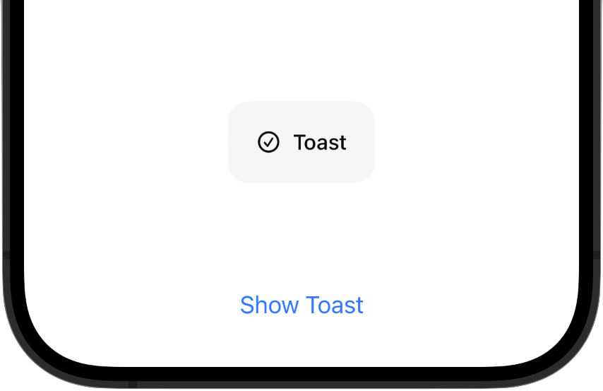

# ToastView
Present a small toast as seen in the Apple Music App  


# Usage


## SwiftUI

Simply add the `toast` ViewModifier.   
The view is presented as soon as `isPresented = true`.  
You can provide an optional title and/or image.  

After dismiss the State is automatically reseted to `false`  

```swift
import ToastView

@State var isShowing = false

var body: some View {
    VStack {
            Button("Show Toast") {
                isShowing.toggle()
            }
        }
        .toast(isPresented: $isShowing,
               title: "Toast", 
               icon: Image(systemName: "checkmark.circle"))
}
```

## UIKit

Call `ToastPresenter.show`. You need to provide an origin view so that the toast knows in which WindowScene it is presented.  
You can provide an optional title and/or image.  

```swift
import ToastView

ToastPresenter.show(title: "Toast", 
                    icon: UIImage(systemName: "checkmark.circle"), 
                    origin: viewController.view)
```
